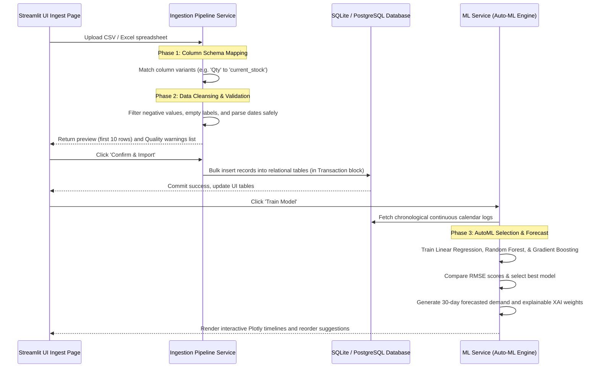

# Pharmacy AI Platform - Enterprise Production Deployment Guide

This document defines the production-grade architecture, data pipelines, relational schemas, and step-by-step deployment roadmaps to transition the **Smart Pharmacy AI Platform** from local SQLite/Streamlit into a high-availability cloud-native system.

---

## 🏛️ 1. Enterprise System Architecture

For a scalable, multi-branch, multi-tenant deployment, we segregate the presentation, API routing, background worker, and relational database layers:

```mermaid
graph TD
    A["Web Browser / Mobile Client"] -->|HTTPS / WSS| B["Reverse Proxy & Load Balancer<br>(NGINX / AWS ALB)"]
    B -->|Route| C["Frontend Server<br>(Streamlit / React Application)"]
    B -->|Route APIs| D["API Gateway & Service Layer<br>(FastAPI Backend Container)"]
    
    D -->|Authenticate| E["OAuth2 & JWT Identity Server"]
    D -->|Queue Job| F["Message Broker<br>(Redis / RabbitMQ)"]
    
    F -->|Process Ingest & ML| G["Background Workers<br>(Celery / Python Workers)"]
    
    D & G -->|Query / Mutate| H["Primary Relational DB<br>(PostgreSQL RDS Cluster)"]
    G -->|Serialize Models| I["Object Storage<br>(AWS S3 Bucket)"]
    
    subgraph Container Orchestration (Kubernetes / ECS)
        C
        D
        G
    end
```

---

## 💾 2. Relational Database Schema Design (Production PostgreSQL)

While the local prototype runs seamlessly on serverless SQLite, the platform is designed to scale directly to **PostgreSQL** to handle concurrent transactions across hundreds of branches. Below is the production-ready DDL script with indices optimized for query performance:

```sql
-- Enable UUID extension for secure, non-sequential public identifiers
CREATE EXTENSION IF NOT EXISTS "uuid-ossp";

-- 1. TENANT MANAGEMENT
CREATE TABLE tenants (
    tenant_id UUID PRIMARY KEY DEFAULT uuid_generate_v4(),
    company_name VARCHAR(255) NOT NULL UNIQUE,
    created_at TIMESTAMP WITH TIME ZONE DEFAULT CURRENT_TIMESTAMP
);

CREATE TABLE branches (
    branch_id UUID PRIMARY KEY DEFAULT uuid_generate_v4(),
    tenant_id UUID NOT NULL REFERENCES tenants(tenant_id) ON DELETE CASCADE,
    branch_name VARCHAR(255) NOT NULL,
    location TEXT,
    created_at TIMESTAMP WITH TIME ZONE DEFAULT CURRENT_TIMESTAMP
);

-- 2. USER AUTHENTICATION & RBAC (Role-Based Access Control)
CREATE TABLE users (
    user_id UUID PRIMARY KEY DEFAULT uuid_generate_v4(),
    tenant_id UUID NOT NULL REFERENCES tenants(tenant_id) ON DELETE CASCADE,
    branch_id UUID REFERENCES branches(branch_id) ON DELETE SET NULL,
    username VARCHAR(100) NOT NULL UNIQUE,
    password_hash VARCHAR(255) NOT NULL,
    role VARCHAR(50) NOT NULL CHECK(role IN ('Admin', 'Manager', 'Pharmacist')),
    full_name VARCHAR(255),
    created_at TIMESTAMP WITH TIME ZONE DEFAULT CURRENT_TIMESTAMP
);
CREATE INDEX idx_users_username ON users(username);

-- 3. SUPPLIER REGISTRY
CREATE TABLE suppliers (
    supplier_id UUID PRIMARY KEY DEFAULT uuid_generate_v4(),
    tenant_id UUID NOT NULL REFERENCES tenants(tenant_id) ON DELETE CASCADE,
    supplier_name VARCHAR(255) NOT NULL,
    contact_email VARCHAR(255),
    contact_phone VARCHAR(50),
    avg_lead_time_days REAL DEFAULT 5.0,
    reliability_score REAL DEFAULT 100.0 CHECK(reliability_score BETWEEN 0 AND 100),
    created_at TIMESTAMP WITH TIME ZONE DEFAULT CURRENT_TIMESTAMP
);

-- 4. BATCH-AWARE INVENTORY
CREATE TABLE medicines (
    medicine_id UUID PRIMARY KEY DEFAULT uuid_generate_v4(),
    tenant_id UUID NOT NULL REFERENCES tenants(tenant_id) ON DELETE CASCADE,
    medicine_name VARCHAR(255) NOT NULL,
    bilingual_name VARCHAR(255),
    category VARCHAR(150),
    is_critical BOOLEAN DEFAULT FALSE,
    unit_price NUMERIC(12, 2) DEFAULT 0.00,
    preferred_supplier_id UUID REFERENCES suppliers(supplier_id) ON DELETE SET NULL,
    created_at TIMESTAMP WITH TIME ZONE DEFAULT CURRENT_TIMESTAMP,
    UNIQUE(tenant_id, medicine_name)
);
CREATE INDEX idx_medicines_tenant_name ON medicines(tenant_id, medicine_name);

CREATE TABLE medicine_batches (
    batch_id UUID PRIMARY KEY DEFAULT uuid_generate_v4(),
    medicine_id UUID NOT NULL REFERENCES medicines(medicine_id) ON DELETE CASCADE,
    branch_id UUID NOT NULL REFERENCES branches(branch_id) ON DELETE CASCADE,
    batch_number VARCHAR(100) NOT NULL,
    quantity_stocked INT NOT NULL CHECK(quantity_stocked >= 0),
    expiry_date DATE NOT NULL,
    received_date DATE DEFAULT CURRENT_DATE
);
CREATE INDEX idx_batches_expiry ON medicine_batches(expiry_date);

-- 5. DAILY TRANSACTION LOGS
CREATE TABLE sales_transactions (
    transaction_id UUID PRIMARY KEY DEFAULT uuid_generate_v4(),
    branch_id UUID NOT NULL REFERENCES branches(branch_id) ON DELETE CASCADE,
    medicine_id UUID NOT NULL REFERENCES medicines(medicine_id) ON DELETE CASCADE,
    quantity_sold INT NOT NULL CHECK(quantity_sold > 0),
    sale_date DATE DEFAULT CURRENT_DATE,
    user_id UUID REFERENCES users(user_id) ON DELETE SET NULL
);
CREATE INDEX idx_sales_date_med ON sales_transactions(sale_date, medicine_id);

-- 6. DATA INGESTION LOGGER
CREATE TABLE import_logs (
    log_id UUID PRIMARY KEY DEFAULT uuid_generate_v4(),
    tenant_id UUID NOT NULL REFERENCES tenants(tenant_id) ON DELETE CASCADE,
    branch_id UUID NOT NULL REFERENCES branches(branch_id) ON DELETE CASCADE,
    upload_date TIMESTAMP WITH TIME ZONE DEFAULT CURRENT_TIMESTAMP,
    filename VARCHAR(255) NOT NULL,
    records_imported INT DEFAULT 0,
    uploaded_by VARCHAR(100) NOT NULL
);
```

---

## 🔄 3. Data Ingestion Pipeline & ML Workflow

When a pharmacist uploads bulk records, the system processes them in a multi-stage pipeline:



---

## 🐳 4. Production Containerization (Docker Setup)

We pack the service stack into isolated container modules using **Docker Compose** to guarantee the exact same run configuration on local dev and cloud nodes.

### Dockerfile (Application Layer)
```dockerfile
# Use a slim, stable python image
FROM python:3.11-slim

# Set system environment variables
ENV PYTHONUNBUFFERED=1 \
    PYTHONDONTWRITEBYTECODE=1 \
    PORT=8501

WORKDIR /app

# Install system dependencies needed for compiling models
RUN apt-get update && apt-get install -y --no-install-recommends \
    build-essential \
    curl \
    libgomp1 \
    && rm -rf /var/lib/apt/lists/*

# Copy and install python libraries
COPY requirements.txt .
RUN pip install --no-cache-dir --upgrade pip && \
    pip install --no-cache-dir -r requirements.txt

# Copy application code
COPY . .

# Expose port and configure startup command
EXPOSE 8501
HEALTHCHECK CMD curl --fail http://localhost:8501/_stcore/health || exit 1
CMD ["streamlit", "run", "app.py", "--server.port=8501", "--server.address=0.0.0.0"]
```

### docker-compose.yml (Infrastructure Layer)
```yaml
version: '3.8'

services:
  # 1. Database Layer (PostgreSQL)
  postgres_db:
    image: postgres:15-alpine
    container_name: pharmacy_postgres_db
    environment:
      POSTGRES_DB: pharmacy_intelligence
      POSTGRES_USER: admin_user
      POSTGRES_PASSWORD: SecureProdPassword123
    ports:
      - "5432:5432"
    volumes:
      - postgres_data:/var/lib/postgresql/data
    healthcheck:
      test: ["CMD-SHELL", "pg_isready -U admin_user -d pharmacy_intelligence"]
      interval: 10s
      timeout: 5s
      retries: 5

  # 2. Web Application Layer (Streamlit Frontend & Backend API)
  web_app:
    build: .
    container_name: pharmacy_web_app
    ports:
      - "8501:8501"
    environment:
      - DB_TYPE=postgresql
      - DB_HOST=postgres_db
      - DB_PORT=5432
      - DB_NAME=pharmacy_intelligence
      - DB_USER=admin_user
      - DB_PASSWORD=SecureProdPassword123
    depends_on:
      postgres_db:
        condition: service_healthy
    volumes:
      - .:/app

volumes:
  postgres_data:
```

---

## 🗺️ 5. Step-by-Step Production Deployment Roadmap

Follow these phases to deploy the platform into a production cloud infrastructure (AWS/GCP):

### Phase 1: Database Setup & Migration (RDS)
1. **Provision Database**: Launch an AWS RDS PostgreSQL instance in a private subnet.
2. **Execute Schemas**: Connect to the instance using a database manager and execute the PostgreSQL DDL script outlined in Section 2.
3. **Seed Administrative Credentials**: Run an initial SQL command to seed the default Tenant and Super-Admin user credentials.

### Phase 2: Object Storage & Model Registry (S3)
1. **Create Storage Buckets**: Set up an AWS S3 bucket to store uploaded raw Excel sheets and serialized trained models (.joblib/pickle).
2. **Configure Access Policies**: Attach an IAM role to your application server allowing read/write privileges strictly restricted to the S3 bucket.

### Phase 3: Application Container Deployment (AWS ECS / EKS)
1. **Build Container Images**: Run `docker build -t pharmacy-app:latest .` and push the image to AWS ECR (Elastic Container Registry).
2. **Configure Task Definitions**: Configure an AWS ECS Fargate task definition, injecting environment variables containing the PostgreSQL connection strings and S3 bucket names securely via **AWS Secrets Manager**.
3. **Launch Load Balancer**: Set up an AWS Application Load Balancer (ALB) routing incoming HTTP traffic on port 80/443 to container instances on port 8501. Attach an SSL Certificate (via AWS ACM) to enforce secure HTTPS endpoints.

### Phase 4: Integration Pipelines & APIs
1. **Expose REST Endpoints**: Refactor `app.py` or write a parallel `api.py` utilizing **FastAPI** to expose POST endpoints (`/api/v1/sales/log-transaction`) for external POS/Billing systems.
2. **Configure POS Syncing**: Provide local pharmacies with a secure API token (JWT) to embed in their local billing ERP, allowing transactional logs to sync to the central cloud automatically.
