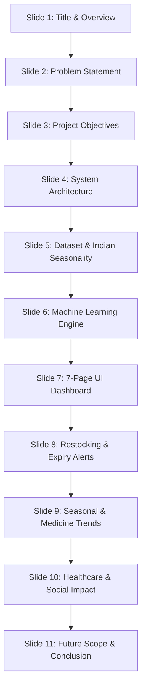
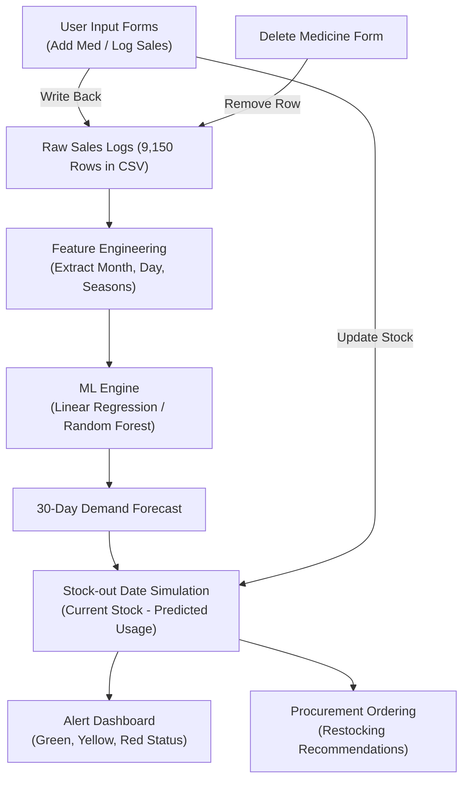

# Smart Pharmacy Inventory Prediction System - Presentation Notes

This document provides a highly structured set of presentation slides, speaker scripts, methodology block diagrams, and viva-voce preparatory guidelines. It is updated to match the **7-page/7-tab multipage architecture**, 25 medical formulations database, and 9,150 sales history logs.

---

## 📌 Slide Structure & Speaker Script

---

### Slide 1: Project Title & Team
* **Slide Title:** Smart Pharmacy Inventory Prediction System for Rural Clinics and Small Pharmacies
* **Subtitle:** An explainable Machine Learning-based healthcare AI to prevent stock shortages and optimize procurement in low-resource environments.
* **Speaker Script:**
  > "Good morning/afternoon, esteemed panel members. Today, we are presenting our project: 'Smart Pharmacy Inventory Prediction System'. Rural primary health centres (PHCs) and small, low-resource pharmacies face severe difficulties in tracking inventory, leading to unpredicted medicine shortages or high medicine wastage due to expiry. Our project aims to address this using simple, explainable Machine Learning."

---

### Slide 2: Problem Statement
* **Slide Key Points:**
  - Inefficient supply chains in rural Primary Health Centres (PHCs) in India.
  - Lack of technical skills or expensive software to track historical drug consumption.
  - Frequent shortages of critical medicines (Insulin, Asthma inhalers, Epilepsy drugs).
  - Significant drug wastage due to unnoticed batch expirations on pharmacy shelves.
* **Speaker Script:**
  > "Why is this system necessary? Unlike commercial, urban chain pharmacies that have expensive, complex software, rural clinics operate on paper ledgers or simple tables. They cannot identify consumption patterns (such as seasonal flu surges in winter or fever spikes during monsoon). This leads to out-of-stock situations for life-saving drugs when they are needed most."

---

### Slide 3: Project Objectives
* **Slide Key Points:**
  - Build a simple, light-weight, local system that runs on any standard student laptop.
  - Implement a **7-page multipage dashboard UI** with a global **bilingual toggle (English + Marathi)**.
  - Use scikit-learn to train explainable prediction models (Linear Regression & Random Forest).
  - Forecast medicine demand for the next 30 days and simulate exact **stock-out dates**.
  - Automate a color-coded warning system (Green/Yellow/Red) and restocking orders.
* **Speaker Script:**
  > "Our objectives are threefold: First, to build an accessible system with a friendly, bilingual UI for local clinic operators. Second, to implement simple and highly transparent machine learning algorithms that don't need complex database infrastructure. Third, to offer action-oriented alerts for restocking and expiration warnings."

---

### Slide 4: System Architecture & Methodology
* **Slide Diagram (Flowchart):**

* **Speaker Script:**
  > "As shown in our block diagram, our system runs in a circular workflow. Historical sales data stored in simple CSV files undergo feature engineering to extract seasonal and weekly demand attributes. This processed data trains the ML engine. The engine forecasts daily consumption for the next 30 days. We then run a subtractive simulation against the current stock level to find the exact date the stock hits zero, which triggers alerts and order recommendations. Pharmacists can update stock or log new daily sales directly, updating the underlying CSV files in real-time."

---

### Slide 5: Dataset Simulation & Indian Seasonality
* **Slide Key Points:**
  - Simulated **365-day dataset** for 25 common medicines (9,150 entries).
  - Seasonal patterns integrated based on actual epidemiological trends in India:
    - **Monsoon (Jun-Sep):** High fever, diarrhea, and cold (Paracetamol, Dolo 650, ORS, Cetirizine, Zinc rise by 2x-3x).
    - **Winter (Oct-Jan):** High cough/flu and asthma (Cough syrups, Levocetirizine, Montelukast & Inhalers rise by 2.5x).
    - **Summer (Feb-May):** Dehydration spikes (ORS demand rises by 3x).
  - Stable demand for chronic ailments (Insulin, Metformin, Phenytoin).
* **Speaker Script:**
  > "To ensure our project is tested under realistic conditions, we developed a seasonal demand generator. It simulates 365 days of clinical transactions representing real-world disease spikes in Maharashtra. For instance, cold medicines surge in winter, fever and rehydration solutions surge during monsoon, and chronic medication like Insulin remains stable all year. This gives our models rich temporal patterns to learn from."

---

### Slide 6: The Machine Learning Models
* **Slide Key Points:**
  - **Linear Regression (LR):** Evaluates mathematical trends. Easily explainable via weights ($y = mx + c$).
  - **Random Forest Regressor (RF):** Ensemble of decision trees. Captures complex, non-linear seasonal peaks.
  - **Features Utilized:** Month, Day of week, Summer flag, Monsoon flag, Winter flag, and 7-day rolling average (lag).
  - **Validation:** 80-20 temporal split. Evaluated using MAE (Mean Absolute Error) and R² Score.
* **Speaker Script:**
  > "We chose two beginner-friendly models to demonstrate different levels of AI maturity. Linear Regression calculates overall baseline trends. For example, it calculates how much demand increases simply by shifting months. The Random Forest model is much better at capturing sudden, non-linear spikes during epidemics. Both models use dates, seasonal binary markers, and recent rolling consumption as learning features, and are evaluated on standard metrics like Mean Absolute Error."

---

### Slide 7: 7-Page UI Dashboard Architecture
* **Slide Key Points:**
  - Built using Streamlit (Python) and Plotly.
  - **1. Home Dashboard:** KPI cards and stock status charts.
  - **2. Inventory Management:** CRUD operations (Search, Add, Update, and Delete forms).
  - **3. Prediction Analytics:** Chosen medicine daily timeline, days left, stock-out date, model choice.
  - **4. Alerts & Risks:** Red/Yellow items, critical medicine monitors, and Expiry Watchdog.
  - **5. Seasonal Insights:** Grouped bar graphs showing category-wise consumption by season.
  - **6. Medicine Trends:** Overlay line comparison charts and category pie allocation.
  - **7. Reports & Exports:** Billing estimates, download CSV buttons, print receipts.
* **Speaker Script:**
  > "Our dashboard has a beautiful multipage layout with 7 distinct pages, styled with healthcare teals and greens. Pharmacists can navigate using the sidebar. Page 1 displays high-level stats. Page 2 covers operations (including adding, updating, and permanently deleting drugs). Page 3 runs the forecasting analytics. Page 4 monitors shelf risks and expiry warnings. Pages 5 and 6 display rich analytics, and Page 7 allows pharmacists to download full inventory and procurement sheets as CSVs."

---

### Slide 8: Restocking & Expiry Alerts
* **Slide Key Points:**
  - **Alerts Engine:** Auto-calculates reorders: `30-day forecast + 8-day safety buffer - current stock`.
  - **Critical Medicine Watchdog:** Highlights life-saving drugs (Insulin, Salbutamol, Carbamazepine) immediately.
  - **Procurement Bills:** Auto-sums total reorder units and financial cost in INR (₹).
  - **Expiry watch:** Flags completely expired medicines and medicines expiring in less than 30 days.
* **Speaker Script:**
  > "Our system features an advanced restocking recommendation engine. It calculates order quantities based on future daily forecasted demand, adds an 8-day safety margin, and subtracts current stock. It highlights critical life-saving drugs first and lists supplier contacts. It also estimates the clinic's procurement budget. The Expiry watch lists expired medicines to discard immediately, and warns of upcoming expirations."

---

### Slide 9: Seasonal & Medicine Trends
* **Slide Key Points:**
  - **Category Pie chart:** Stock value share on pharmacy shelves.
  - **Overlay Trends:** Select multiple medicines and compare their consumption lines over the past year.
  - **Seasonal Insights:** Displays category-wise usage variations across Summer, Monsoon, and Winter.
* **Speaker Script:**
  > "To help pharmacists understand their operations, our app provides deep analytics. Pharmacists can overlay and compare multiple medicines on a single line chart to inspect overlapping trends. It also graphs category allocations, showing exactly how much shelf share is held by antibiotics versus analgesics."

---

### Slide 10: Healthcare & Social Impact
* **Slide Key Points:**
  - **Zero Data Loss:** Simple local CSVs ensure data remains offline, avoiding cloud costs or internet downtime in remote villages.
  - **Prevents Shortages:** Guarantees critical medications (e.g., Insulin for diabetics, Salbutamol for asthma patients) are always available.
  - **Cost Optimization:** Small pharmacies avoid over-purchasing drugs that would expire, saving capital.
  - **Bilingual Accessibility:** Marathi support empowers local clinic staff to manage systems confidently.
* **Speaker Script:**
  > "The primary social impact is the democratization of healthcare AI. By running 100% locally and in Marathi, we remove technical barriers for remote clinics. It prevents stock-outs of life-saving medicines while helping cash-strapped clinics avoid wasting capital on over-stocking drugs that will only expire on shelves."

---

### Slide 11: Future Scope & Conclusion
* **Slide Key Points:**
  - **Future Upgrades:**
    - Integration with local government health databases (e.g., e-Sanjeevani).
    - Upgrading CSV to light SQL databases (SQLite) for security.
    - Adding SMS alerts to local medical distributors when stock hits yellow risk.
  - **Conclusion:**
    - Achieved a highly visual, realistic system with zero complex setup overhead.
    - Successfully demonstrated that Machine Learning can solve low-resource problems without expensive deep learning.
    - Clean, modular, and easy-to-understand code ideal for student presentation and review.
* **Speaker Script:**
  > "To conclude, our Smart Pharmacy Inventory Prediction System represents a practical, realistic, and highly explainable application of machine learning. It bridges the gap between modern data science and rural healthcare. We are now happy to show you a live demonstration. Thank you, and we welcome your questions!"

---

## ❓ Viva-Voce (Q&A) Preparation Guide

Here are the most common questions examiners ask during presentations, along with high-scoring answers.

### Q1: Why did you choose Linear Regression and Random Forest instead of advanced Deep Learning / LSTM?
* **Answer:** "Deep learning models (like LSTM or Transformers) require thousands of historical data points, high computing power (GPUs), and are 'black-box' models, meaning we cannot easily explain their decisions. Rural clinics run on basic laptops without internet or GPUs. Linear Regression and Random Forest models are light, train in less than a second on standard CPUs, work extremely well on smaller tabular datasets, and are highly explainable, which builds trust with clinical practitioners."

### Q2: What is "Feature Engineering" in your project, and why did you create seasonal flags?
* **Answer:** "Feature engineering is the process of converting raw data columns into meaningful mathematical inputs that help the ML model learn better. A raw date (e.g., `2026-05-26`) doesn't mean much to a model. We extracted:
  1. `month` & `day_of_week` (to capture weekly sales patterns and monthly trends).
  2. `is_summer`, `is_monsoon`, and `is_winter` binary flags (since diseases and medicine consumption in India are highly seasonal).
  3. `rolling_avg` (to capture the immediate past sales rate, which guides the model on current consumption speed)."

### Q3: How do you calculate the "Days of Stock Left" and the "Predicted Stock-Out Date"?
* **Answer:** "We don't just divide current stock by a single average daily usage, because demand changes daily. Instead, we use our trained ML model to forecast the exact daily demand for each of the next 30 days. We then run a day-by-day simulation: we start with the current stock and subtract the forecasted demand for day 1, then day 2, and so on. The exact day our simulated stock hits $0$ (or drops below the safety threshold) is identified as the **Stock-Out Date**."

### Q4: How are the risk colors (Green, Yellow, Red) determined?
* **Answer:** "We categorize risk using a time-based safety window:
  - **Red Alert (Urgent):** If stock is completely empty, or will run out in $\le 7$ days. This requires immediate order placement.
  - **Yellow Alert (Low Stock):** If stock is predicted to last between $8$ and $15$ days, or has dropped below the customized safety threshold.
  - **Green (Safe):** If stock is safe and will last for more than $15$ days.
  This allows pharmacists to instantly scan the dashboard and prioritize critical tasks."

### Q5: How is data saved? What happens when a user updates stock or logs sales?
* **Answer:** "Our backend uses Pandas to read and write directly to local CSV files (`medicine_inventory.csv` and `daily_usage_history.csv`). When a pharmacist adds a medicine, updates stock levels, or logs daily usage in the Streamlit UI, the app captures the inputs, modifies the Pandas DataFrame, and instantly saves it back to the CSV file using `to_csv()`. This ensures that all updates are persistent and the AI model immediately learns from new data on page refresh."
