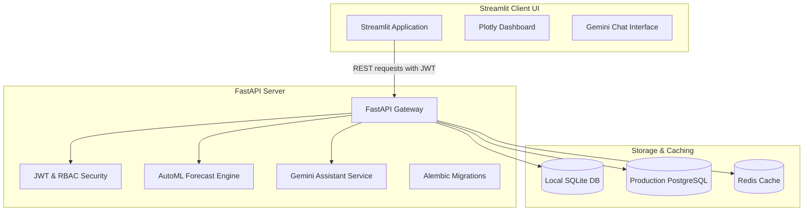

# Smart Pharmacy Inventory Predictor & Clinical AI 🩺🔮
### *Production-Grade AI-Powered Demand Forecasting & Clinical Assistant for Rural Clinics and PHCs*

---

## 🌟 Platform Overview
This project is a production-ready, full-stack **Smart Pharmacy Inventory Prediction System** designed for Indian Primary Health Centres (PHCs), rural clinics, and small pharmacies. 

It is a decoupled, secure, and containerized application featuring a **FastAPI backend** (using SQLAlchemy ORM, Alembic migrations, and repository pattern), a **Streamlit frontend client** (with interactive Plotly charts, dark mode, and an AI assistant), a relational database (PostgreSQL in production/Docker, SQLite for local runs), and advanced ML forecasting (Linear Regression, Random Forest, XGBoost) with Explainable AI (SHAP) and a **Google Gemini AI chatbot assistant**.

---

## 🏗️ Architecture & Data Flow



---

## 📁 Directory Layout
```text
EMBS internship/
├── backend/
│   ├── alembic/             # Alembic migration scripts and history
│   ├── app/
│   │   ├── config/          # Pydantic Settings loaders (with absolute SQLite pathing)
│   │   ├── database/        # DB sessions & database seeders
│   │   ├── models/          # 18 relational SQLAlchemy database models
│   │   ├── schemas/         # Pydantic validation schemas (optional tenant inputs)
│   │   ├── repositories/    # Generic and model-specific repositories (deferred commits support)
│   │   ├── services/        # Business logic (Auth, ML, Gemini, PDF reports, Alerts)
│   │   ├── routers/         # FastAPI endpoint route definitions
│   │   └── main.py          # ASGI application entrypoint & startup migrations
│   ├── tests/               # Pytest API unit test suite (9 test cases passing)
│   └── Dockerfile           # Backend containerization dockerfile
├── frontend/
│   └── streamlit_app.py     # Streamlit frontend client (calls FastAPI APIs)
├── requirements.txt         # Project dependencies (FastAPI, Streamlit, ML, Gemini, PostgreSQL driver)
├── docker-compose.yml       # Connects Postgres, Redis, and FastAPI app
├── .env.example             # Configuration variables template
└── README.md                # General documentation (This file)
```

---

## ⚡ Key Upgraded Features

### 1. Robust Clean Backend Architecture
*   **FastAPI Engine**: Employs async FastAPI serving structured REST APIs under the `/api/v1` namespace.
*   **Clean Layering**: Logic is separated strictly into routers (API routes), schemas (validation), models (SQLAlchemy), repositories (DB CRUD), and services (business logic).
*   **Security & RBAC**: Implements secure JWT access tokens and long-lived refresh tokens. Cryptographic hashing via `bcrypt` handles password security. Role-Based Access Control (RBAC) regulates operations for five distinct roles:
    *   `Administrator` (Group level configuration)
    *   `Branch Manager` (Registers staff and logs stock shipments)
    *   `Pharmacist` (Records sales and reviews predictions)
    *   `Supplier` (Checks pending purchase orders)
    *   `Government Officer` (Monitors regional outbreaks)

### 2. Redesigned Relational Schema & Alembic Migrations
*   **18 Tables**: `User`, `Tenant`, `Branch`, `Supplier`, `Medicine`, `Category`, `Inventory` (Batch-aware stock), `PurchaseOrder`, `PurchaseOrderItem`, `Sale`, `SaleItem`, `DemandHistory`, `Prediction`, `Alert`, `Notification`, `AuditLog`, `ExpiryTracking`, `DiseaseTrend`, `UserSession`, `ForecastJob`.
*   **Alembic Migrations**: Fully integrated database version control. Safe, programmatic migration upgrades are executed automatically on server startup. Development fallback automatically resets SQLite databases in case of schema validation failure.

### 3. Advanced ML forecasting & SHAP
*   **Model Selection**: Automatically trains **Linear Regression**, **Random Forest**, and **XGBoost** models on chronological 80-20 splits. Compares RMSE, MAE, and MAPE metrics, and automatically deploys the best performing model.
*   **Prediction Intervals**: Computes 95% confidence intervals to generate lower/upper bounds for demand forecasting.
*   **Explainable AI (XAI)**: Utilizes **SHAP** values to extract exact feature importance percentages, explaining to clinicians why predictions were made (e.g. current rolling sales momentum, season surges, or day of the week).

### 4. Gemini AI Chatbot Assistant
*   Integrates Google's **Gemini Pro** API.
*   The assistant parses live database context (current stock shortages, active expiry warnings, reorder suggestions) to contextually answer queries.

---

## 🛠️ Step-by-Step Setup Guide

### Option A: Local Run (SQLite Default)
Perfect for development and quick testing.

1.  **Install dependencies**:
    ```bash
    pip install -r requirements.txt
    ```
2.  **Configure environment**:
    Copy `.env.example` to `.env` and fill in your details (especially `GEMINI_API_KEY` for chatbot assistant).
3.  **Start FastAPI Backend**:
    ```bash
    python -m uvicorn backend.app.main:app --reload
    ```
    On launch, the backend automatically runs migrations to initialize a local SQLite file `data/pharmacy_platform.db` and populates it with realistic seed data.
4.  **Start Streamlit Frontend**:
    In a new terminal window, run:
    ```bash
    streamlit run frontend/streamlit_app.py
    ```
    This launches the client UI at `http://localhost:8501`.

### Option B: Docker Compose Run (PostgreSQL + Redis)
Ideal for production-like environments.

1.  **Configure environment**:
    Create `.env` file containing your config.
2.  **Build and launch container group**:
    ```bash
    docker-compose up --build
    ```
    This launches:
    *   `PostgreSQL` database container (seeded automatically)
    *   `Redis` cache container
    *   `FastAPI` app container on port `8000`
3.  **Run Streamlit client locally**:
    ```bash
    streamlit run frontend/streamlit_app.py
    ```

---

## 🧪 Testing
Run the pytest test suite to verify route, auth, inventory, and forecast health:
```bash
$env:PYTHONPATH="."
pytest backend/tests/
```

---

## 🌐 API Documentation
When the backend server is running, interactive API docs are available at:
*   **Swagger UI**: `http://localhost:8000/docs`
*   **ReDoc**: `http://localhost:8000/redoc`

---

## 🚀 Deployment Instructions

### Render
1.  Create a **PostgreSQL Database** on Render.
2.  Deploy the backend as a **Web Service**:
    *   Environment: `Docker`
    *   Docker Command: `uvicorn backend.app.main:app --host 0.0.0.0 --port 10000`
    *   Set Env Vars: `DATABASE_URL` (rendered PG URL), `ENV=production`, `JWT_SECRET`, `GEMINI_API_KEY`.
3.  Deploy the frontend as a **Web Service**:
    *   Environment: `Python`
    *   Build Command: `pip install -r requirements.txt`
    *   Start Command: `streamlit run frontend/streamlit_app.py --server.port $PORT`
    *   Set Env Var: `BACKEND_URL` to point to the Render backend service URL.

### Google Cloud Run
1.  Build and push backend image to Google Artifact Registry:
    ```bash
    gcloud builds submit --tag gcr.io/your-project/smart-pharmacy-backend backend/
    ```
2.  Deploy Backend to Cloud Run:
    ```bash
    gcloud run deploy smart-pharmacy-backend --image gcr.io/your-project/smart-pharmacy-backend --platform managed --allow-unauthenticated
    ```
3.  Set Env Vars for DB connection and secrets in Google Cloud Console.
